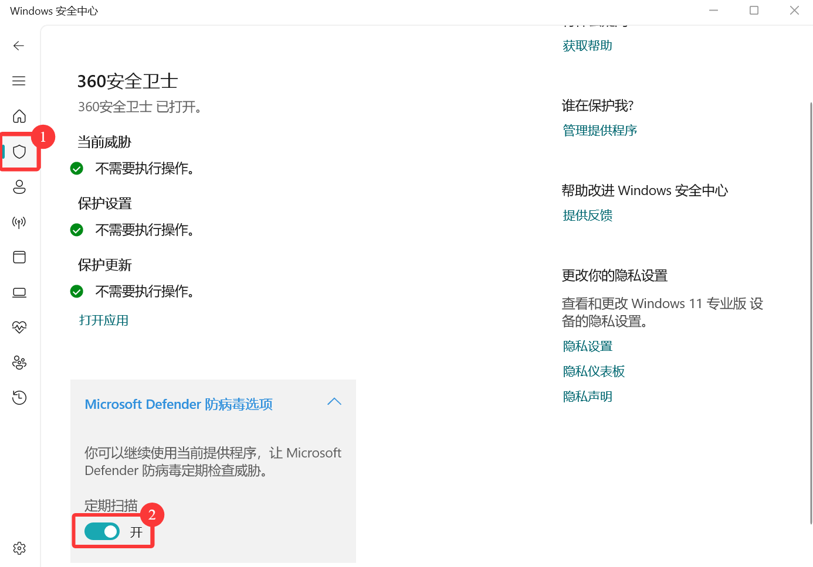

开始使用StarRailAssistant
============================
下载
----------------
前往`下载页面 <https://starrailassistant.top/SRA/downloadhtml>`_ 选择渠道进行下载

添加信任
----------------
 SRA拥有多种敏感动作（包括但不限于 `获取管理员权限`、 `读写注册表`、 `操作屏幕`）而导致容易被安全软件误报隔离。
 在运行软件前，可以将SRA的安装目录添加到安全软件的信任列表中以避免被误杀。
 此处展示如何在 `Windows Defender`中添加信任：
1. 打开 `Windows Defender <ms-settings:windowsdefender>`_ 

如果链接无效，请手动打开 `Windows Defender`

如果安装了其他的防病毒软件，请先打开 *定期扫描*。

#. 打开 `病毒和威胁防护`设置 -> `管理设置`

.. image:: ../asset/img/trust/truststep2.png

#. 点击 `排除项` -> `添加或删除排除项`

.. image:: ../asset/img/trust/truststep3.png

#. 点击 `排除项` -> 选择对应目录

#. 若已经安装其他软件，再次关闭 *定期扫描*。

.. warning:: 
   如果你拥有其他安全软件，你可能需要额外配置。

   即使已经安装其它杀毒软件（如：火绒、360极速版），Windows Defender 防病毒功能仍可能会不定时开启， 这可能导致您的 SRA.exe 突然消失。因此，您必须确保以上目录被 Windows Defender 排除。

安装&启动
----------------
作为一个绿色程序，SRA不需要安装，直接解压缩后运行 `SRA.exe`即可。

推荐为SRA创建快捷方式，但不要修改源程序的位置。

运行时需要以管理员身份运行。

.. image:: /../asset/img/use/software.png
   :alt: SRA.exe

启动成功后，将同时弹出公告及主界面。点击确认可关闭公告，点击不再提醒可关闭公告，直到下次更新前将不再弹出。

.. image:: /../asset/img/use/softwaremain.png
   :alt: SRA主界面

运行前配置
----------------
在首次执行任务前，需要前往 `设置`标签页进行必要的设置：
1. **线程安全**: 开启后，在停止任务时，SRA将会等待当前操作结束再停止
#. **屏幕缩放**: 您需要前往 `设置`，找到 `系统` -> `屏幕`，查看 `缩放与布局`(Windows 10)或 `缩放`(Windows 11)的值，并在SRA中设置相同的值。
.. warning:: 
   注意缩放的转换，例如如果您的缩放设置是 `125%`，那么在SRA的设置中应该输入 `1.25`而不是 `125`。
#. **性能参数**：用于控制您的等待时间，默认值为2s。如果你认为你的电脑性能较弱，请提高此参数。
其他参数将在之后介绍。
.. warning:: 
    - 确保使用1920x1080分辨率或1600x900分辨率。
    - 确保您已经调整好了屏幕缩放参数。

任务配置
----------------
.. image:: /../asset/img/use/mission.png

在主界面左侧进行任务配置。如要启用某个任务，将他前方的复选框勾选，点击设置来配置任务。

